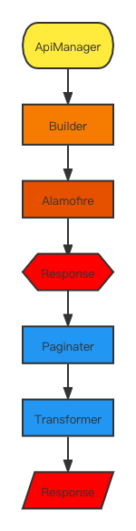

# ACINetworking

ACINetworking 是基于`Alamofire`封装的业务网络处理层，使网络请求更简洁，更易维护。

日常开发中，我们可以都会对网络请求进行包装，也可以直接使用[Moya](https://github.com/Moya/Moya)作为业务网络请求工具，Moya 是一套很完整的请求封装，为什么还要在它之外，自己封装一个呢？第一，我们可以更了解网络请求中怎么请求在转发过程中做了哪些处理；第二，利于我们的业务处理，我们可以自己自定义添加自己的业务处理。

首先，我们看一下我们的每一层的设计



然后，每一层的使用方式及用途。

# ApiManager

ApiManger 用于管理请求，其中包含

1. [Node](https://github.com/zevwings/ACINetworking/blob/master/Sources/ACINetworking/ApiManager/Node.swift) - 服务器节点管理
2. [Route](https://github.com/zevwings/ACINetworking/blob/master/Sources/ACINetworking/ApiManager/Route.swift) - 请求方式、请求路径管理
3. [Content](https://github.com/zevwings/ACINetworking/blob/master/Sources/ACINetworking/ApiManager/Content.swift) - 请求参数、参数解码方式管理 
4. HeaderFields - 请求头参数管理
5. [Paginator](https://github.com/zevwings/ACINetworking/blob/master/Sources/ACINetworking/ApiManager/Paginator.swift) - 分页管理
6. [Transformer](https://github.com/zevwings/ACINetworking/blob/master/Sources/ACINetworking/ApiManager/Transformer.swift) - 返回结果通用处理
7. [ValidateType](https://github.com/zevwings/ACINetworking/blob/master/Sources/ACINetworking/ApiManager/ValidationType.swift) - 服务器返回 Code 校验

**示例**

```
    enum AccountAPI {
        case login(username: String, password: String)
    }

    extension AccountAPI : ApiManager {

        var node: NetworkingNode {
            return .default
        }

        var route: Route {
            switch self {
            case .login:
                return .get("example-api/login/")
            }
        }

        var content: Content {
            switch self {
            case let .login(username, password):
                let parameters: [String: Any] = [
                    "username": username,
                    "password": password
                ]
                return .requestParameters(parameters: JSONEncoding() => parameters)
            }
        }

        var transformer: Transformer? {
            return StandardTransformer.standard
        }
    }
```
<br />

### Node - 服务器节点管理

服务器可能会存在多个节点提供给服务器访问，例如 App 节点和支付节点可能是两个不同的路径或者不同 URL，我们可以将他们维护到`Node`中。

**示例**

```
public enum NetworkingNode {
    case `default`
    case payment
}

extension NetworkingNode: Node {

    public var baseURL: URLConvertible {
        switch self {
        case .default:
            return "https://example.com.cn/base-api"
        case .payment:
            return "https://example.com.cn/payment-api"
        }
    }
}
```
<br />

### Paginator - 分页管理

日常开发中我们会存在很多列表的分页管理，我们可能会维护一个`pageSize`和`pageNum`字段到`ViewModel`或者`ViewController`中，然后分开处理，这样我们就会有很多重复的代码，我们将`Paginator`实现后，维护到`ViewModel`或者`ViewController`中，并作为参数传入`ApiManger`便可以自动管理分页。 

```
public final class Pager : Paginator {

    public var totalCount: Int = 0
    public var totalPage: Int = 0
    public var currentPage: Int = 1

    public var index: Int = 1
    public var indexKey: String {
        return "pageIndex"
    }

    public var count: Int { return 12 }
    public var countKey: String {
        return "pageSize"
    }

    @discardableResult public func reset() -> Int {
        index = 1
        return index
    }

    @discardableResult public func next() -> Int {
        index += 1
        return index
    }

    public func updateIndex(_ data: Data?) throws {

        guard let data = data else { return }

        let options: JSONSerialization.ReadingOptions = [
            .allowFragments,
            .mutableLeaves,
            .mutableContainers
        ]

        let json: [String: Any]?
        do {
            json = try JSONSerialization.jsonObject(with: data, options: options) as? [String: Any]
        } catch {
            throw HTTPError.external(error, request: nil, response: nil)
        }

        if let page = json?["page"] as? [String: Any],
           let currentPage = page["currentPage"] as? Int,
           let totalPage = page["totalPage"] as? Int,
           let totalCount = page["totalPage"] as? Int {
            self.currentPage = currentPage
            self.totalPage = totalPage
            self.totalCount = totalCount
        }
        
        _ = next()
    }
}
```
<br />

### Transformer - 返回结果通用处理

服务器返回会有一层统一的封装，给我们统一的格式，如下所示：

**服务器返回数据**
```
{
    "code": 0,
    "message": "成功",
    data: {
        "name": "zevwings"
    }
}
```
<br />

每次我们都需要重复的从 JSON 中获取`data` 字段的数据，然后映射成数据模型或者生成错误展示`message`字段，我们可以通过统一的`Transformer`处理后返回`data`节点的数据

**示例**

```
public struct StandardTransformer : Transformer {

    public func transform(_ data: Data?) throws -> Data? {

        do {
            guard let data = data else {
                throw TransformerError.dataEmpty
            }

            let json = try JSONSerialization.jsonObject(with: data, options: .allowFragments)

            guard
                let object = json as? [String: Any],
                let data = object["data"]
            else {
                throw TransformerError.dataMissing
            }

            guard JSONSerialization.isValidJSONObject(data) else {
                throw TransformerError.dataMissing
            }

            return try JSONSerialization.data(withJSONObject: data, options: .prettyPrinted)
        } catch {
            throw TransformerError.dataMissing
        }
    }
}
```
<br />

如上，是[ApiManager](https://github.com/zevwings/ACINetworking/blob/master/Sources/ACINetworking/ApiManager/ApiManager.swift)的使用，可以通过源码和Demo了解更多使用细节。

# HTTPClient

`HTTPClient`是客户端的调度者，他的功能如下：
1. 它管理一个 ApiManger
2. 通过`Buidler`转换为`Alamofire`的`Request`
3. 发起请求并处理返回结果，通过闭包返回一个 `Response`

**使用示例**

```
import ACINetworking

let client = HTTPClient<ExampleAPI>(
    session: .default,
    plugins: [OSTypePlugin()]
)
client.request(api: .userInfo) { result in
    switch result {
    case let .success(response):
        let json = try? response.mapJSON()
        print(json)
    case let .failure(error):
        print(error)
    }
}
```

### Buidler

Buidler 会将`ApiManager`转换为`Alamofire`的`Request`，我们可以实现 BuilderType 协议，自定义处理过程。

### Response

Response 是对返回值的一次包装，我们可以从其中拿到请求(URLRequest)，返回(URLResponse)，状态码(statusCode)以及返回数据(data)。

# 安装方式

### Cocoapods

你可以将如下代码添加到`Podfile`并执行`pod install`即可安装
```
platform :ios, '8.0'

target 'TargetName' do
    use_frameworks!
    pod 'ACINetworking.swift' ~> '3.0.0'
end
```

### Carthage

使用 Carthage 集成是，将如下代码添加到`Cartfile`，并执行 `carthage update` 即可安装

```
github "zevwings/ZVRefreshing"
```

### Swift Package Manager

使用`SPM`集成只需要将如下代码添加到`Package.swift`即可。
```
.package(url: "https://github.com/zevwings/ACINetworking.git", .upToNextMajor(from: "3.0.0"))
```

# 其他
欢迎和我一起讨论 iOS 的网络封装和其他的技术问题。
<br />
邮箱：<zev.wings@gmail.com>
<br />
QQ：594091481

# License

`ACINetworking` distributed under the terms and conditions of the [MIT License](https://github.com/zevwings/ACINetworking/blob/master/LICENSE)

